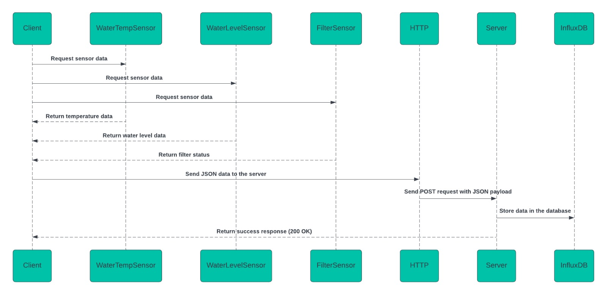
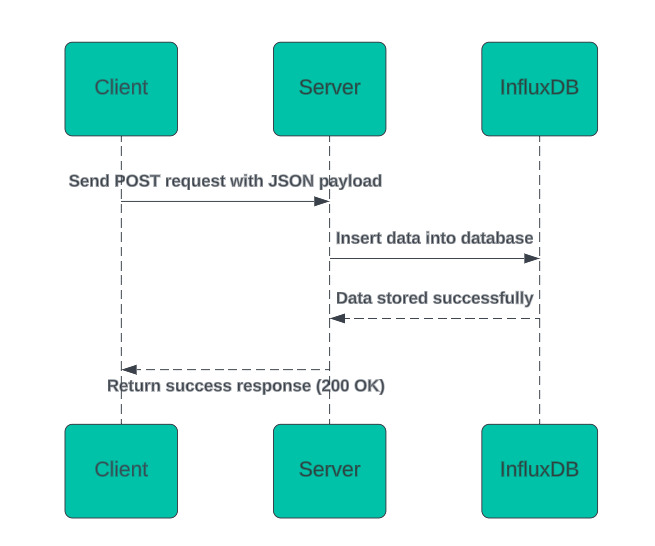

### Corso protocolli di comunicazione IoT
Dal Cin Eva e Di Bert Giacomo

### Sistema di Monitoraggio della Casetta dell'Acqua

**Panoramica**  
Questo progetto implementa un sistema di monitoraggio per una casetta dell'acqua utilizzando diversi sensori per raccogliere dati come la temperatura dell'acqua, il livello dell'acqua e lo stato del filtro. I dati vengono raccolti dai sensori, inviati a un server e memorizzati in un database InfluxDB per ulteriori elaborazioni e analisi.

**Architettura**  
Il sistema è composto da due parti principali:

1. **Client (Lato Casetta dell'Acqua)**: Raccoglie i dati dai sensori e li invia al server.
2. **Server**: Riceve i dati dal client, li elabora e li memorizza nel database InfluxDB.

### Flowchart: Funzionamento dell'applicazione lato casetta (Sensori e Invio Dati)

1. **Inizio**  
   - L'applicazione inizia.

2. **Inizializzazione Sensori**  
   - Creazione degli oggetti sensori:
     - `WaterTempSensor`
     - `WaterLevelSensor`
     - `FilterSensor`

3. **Loop Infinito**  
   - L'applicazione entra in un ciclo infinito.

4. **Ciclo su ciascun sensore**  
   - Per ciascun sensore (ad esempio `WaterTempSensor`, `WaterLevelSensor`, `FilterSensor`):
     1. **Lettura Dato Sensore**  
        - Ogni sensore raccoglie il dato (ad esempio temperatura per `WaterTempSensor`, livello dell'acqua per `WaterLevelSensor`, stato del filtro per `FilterSensor`).
     2. **Creazione JSON**  
        - Il dato raccolto viene serializzato in formato JSON.

5. **Invio Dato al Server**  
   - I dati del sensore vengono inviati al server tramite HTTP POST all'endpoint configurato.

6. **Pausa di 1 Secondo**  
   - L'applicazione aspetta un secondo prima di passare al sensore successivo.

7. **Ripeti per tutti i sensori**  
   - Continua il ciclo per ciascun sensore finché l'applicazione non viene fermata.

### Flowchart: Lato Server (Ricezione e Memorizzazione dei Dati)

1. **Inizio**  
   - Il server inizia e ascolta sulla porta 8011.

2. **Ricezione Dati HTTP**  
   - Il server riceve una richiesta HTTP POST dall'applicazione lato casetta all'endpoint `/water_coolers/:id`.

3. **Parsing Dati**  
   - I dati JSON inviati dal client vengono analizzati:
     - `id` della casetta dell'acqua.
     - `Name` del sensore (ad esempio "temperature", "waterLevel", "filterStatus").
     - `Value` del dato raccolto.

4. **Elaborazione Dati**  
   - I dati vengono elaborati dalla funzione `insertWaterCoolerData`.

5. **Inserimento nel Database InfluxDB**  
   - I dati vengono inseriti nel database InfluxDB, utilizzando un tag basato sull'ID della casetta (`water_coolers#<id>`), e un campo che rappresenta il sensore (es. `temperature`, `waterLevel`, `filterStatus`).

6. **Risposta al Client**  
   - Dopo aver inserito correttamente i dati nel database, il server risponde al client con un codice di stato 200 (successo).

7. **Errore**  
   - Se si verifica un errore durante l'inserimento dei dati, il server invia un codice di stato 500 (errore interno).

8. **Fine**  
   - La richiesta è stata completata, il server ritorna in ascolto per nuove richieste.

---

### Esempio di JSON con il Payload dei dati inviati

I dati inviati dall'applicazione al server sono in formato JSON. Di seguito è un esempio di payload JSON:

```json
{
  "Name": "sensorName",
  "Value": sensorValue
}
```

Nel caso di `WaterTempSensor`, il payload JSON potrebbe apparire come segue:

```json
{
  "Name": "temperature",
  "Value": 23
}
```

---

### Diagrammi di Sequenza

#### Diagramma di sequenza lato Client:



#### Diagramma di sequenza lato Server:


