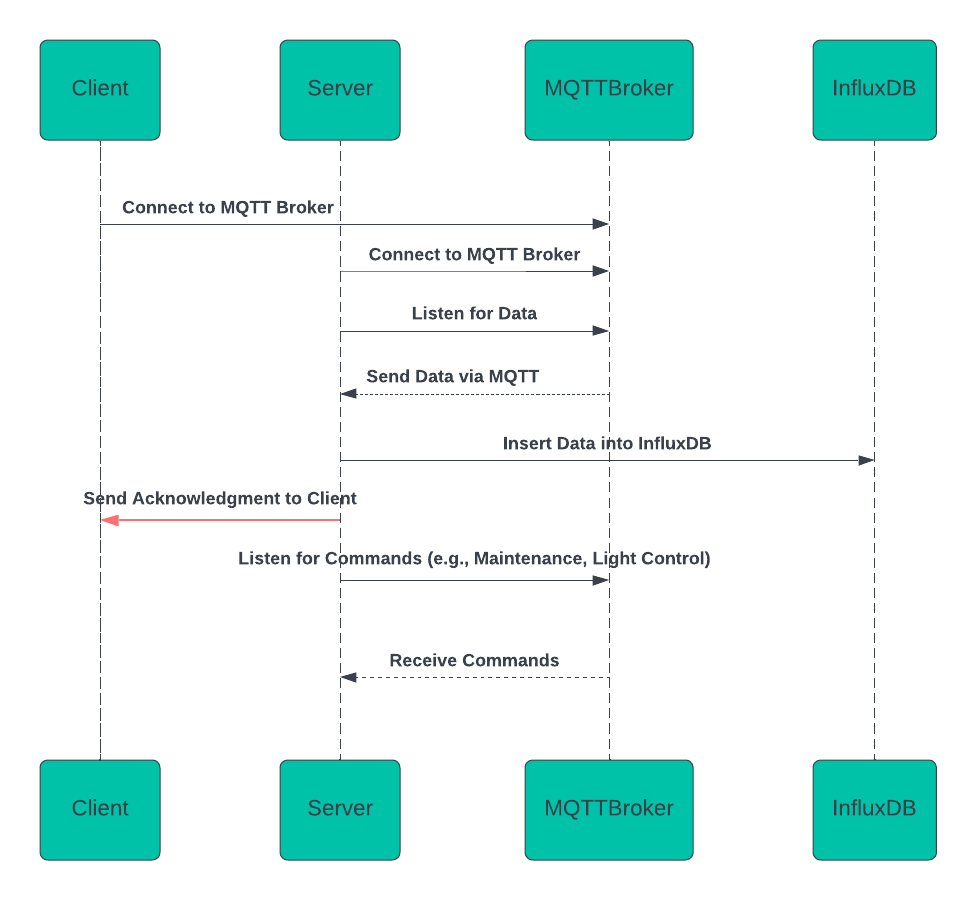

# Corso protocolli di comunicazione IoT

Dal Cin Eva e Di Bert Giacomo

#### Panoramica

Il progetto implementa un sistema di monitoraggio per una casetta dell'acqua, utilizzando sensori per raccogliere dati come la temperatura dell'acqua, il livello dell'acqua e lo stato del filtro. I dati vengono inviati tramite il protocollo **MQTT** a un server, che li memorizza in un database **InfluxDB**.

#### Architettura

Il sistema è composto da due componenti principali:

1. **Client (Lato Casetta dell'Acqua)**: Raccoglie i dati dai sensori e li invia al server tramite MQTT.
2. **Server**: Riceve i dati dal client, li elabora e li memorizza nel database **InfluxDB**.

#### Flusso di Lavoro

##### 1. Funzionamento Lato Client (Sensori e Invio Dati)

1. **Inizio**: L'applicazione inizia.
2. **Inizializzazione Sensori**: Creazione degli oggetti sensori:
    - `WaterTempSensor` (Temperatura dell'acqua)
    - `WaterLevelSensor` (Livello dell'acqua)
    - `FilterSensor` (Stato del filtro)
3. **Loop Infinito**: L'applicazione entra in un ciclo continuo.
4. **Ciclo su ciascun sensore**:
    - Ogni sensore raccoglie il dato (es. temperatura, livello dell'acqua, stato del filtro).
    - I dati raccolti vengono serializzati in formato JSON.
5. **Invio Dati al Server**: I dati vengono inviati tramite MQTT al topic appropriato.
6. **Pausa di 1 Secondo**: Dopo ogni invio, l'applicazione aspetta un secondo prima di passare al sensore successivo.
7. **Ripeti**: Il ciclo continua per ciascun sensore fino a quando l'applicazione non viene fermata.

##### 2. Funzionamento Lato Server (Ricezione e Memorizzazione dei Dati)

1. **Inizio**: Il server si avvia e si connette al broker MQTT.
2. **Ricezione Dati MQTT**: Il server riceve i dati dai sensori tramite MQTT.
3. **Parsing Dati**: I dati JSON vengono analizzati per estrarre:
    - `Name` (es. "temperature", "waterLevel", "filterStatus")
    - `Value` (valore raccolto dal sensore)
    - `coolerId` (ID della casetta dell'acqua)
4. **Elaborazione e Inserimento nel Database**: I dati vengono inseriti nel database **InfluxDB**.
5. **Risposta al Client**: Dopo aver memorizzato correttamente i dati, il server invia una conferma al client.

#### Esempio di JSON con il Payload dei Dati Inviati

Quando il client invia i dati al server, i messaggi MQTT contengono payload in formato JSON. Ecco un esempio del formato:

##### Payload JSON per i Sensori:

- **Temperatura dell'Acqua (WaterTempSensor)**:

```json
{
  "Name": "temperature",
  "Value": 23
}
```

#### MQTT Topic Utilizzati

- **Dati dei Sensori**: Il client invia i dati dei sensori al server utilizzando topic MQTT strutturati come segue:

```
iot2025/water_coolers/<ID_CASSETTA>/sensor/<SENSOR_NAME>
```

Dove:

- `<ID_CASSETTA>` è l'ID della casetta dell'acqua.
- `<SENSOR_NAME>` è il nome del sensore (es. "temperature", "waterLevel", "filterStatus").

Ad esempio:

- **Temperatura** (WaterTempSensor): `iot2025/water_coolers/123/sensor/temperature`
- **Livello dell'Acqua** (WaterLevelSensor): `iot2025/water_coolers/123/sensor/waterLevel`
- **Stato del Filtro** (FilterSensor): `iot2025/water_coolers/123/sensor/filterStatus`

##### Esempio di Topic per Dati:

```
iot2025/water_coolers/123/sensor/temperature
```

Il messaggio ricevuto avrà un payload JSON, ad esempio:

```json
{
  "Name": "temperature",
  "Value": 23
}
```

##### 3. Funzionamento Lato Server per Gestione Comandi

Il server può anche ricevere comandi MQTT per eseguire azioni come accendere/spegnere luci notturne o attivare/disattivare la modalità manutenzione. I topic per i comandi sono strutturati come segue:

```
iot2025/water_coolers/<ID_CASSETTA>/command
```

Dove:

- `<ID_CASSETTA>` è l'ID della casetta dell'acqua.

##### Esempio di Topic per Comandi:

```
iot2025/water_coolers/123/command
```

##### Payload JSON per Comandi:

- **Accendere la luce notturna** (Comando `light_on`):

```json
{
  "command": "light_on",
  "status": true
}
```

- **Attivare la modalità manutenzione** (Comando `maintenance_mode`):

```json
{
  "command": "maintenance_mode",
  "status": true
}
```

#### Codice Lato Server (MQTT.js)

Il server si connette al broker MQTT e ascolta i topic per i dati e i comandi. Quando riceve un messaggio, lo elabora, salva i dati nel database e risponde ai comandi.

#### Diagramma di sequenza:

